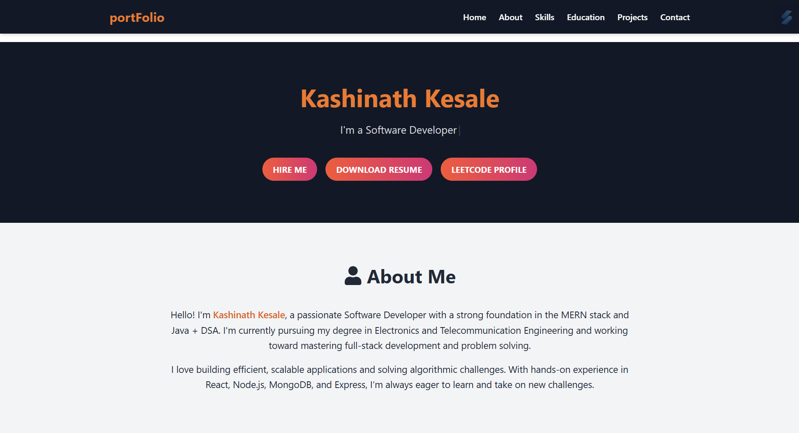
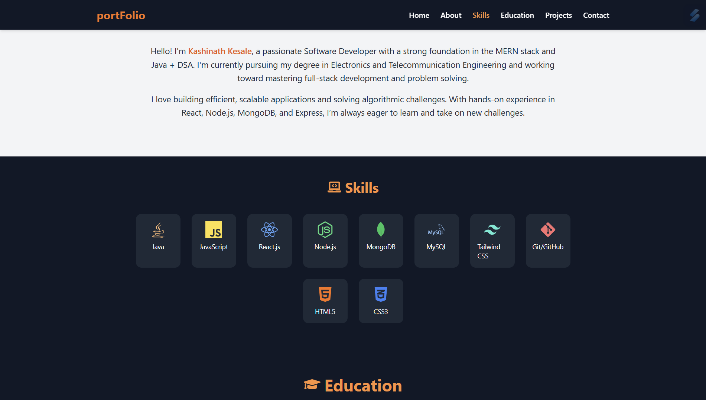

# 👨🏻‍💻 PortFolio | Kashinath Kesale

This is a fully responsive personal portfolio website built using **React.js** and **Tailwind CSS**, deployed on **Vercel**. It showcases my profile, skills, education, projects, and contact information in a modern and elegant design.

### 🔗 Live Site  
**🌐** [kashinath-kesale-portfolio.vercel.app](https://kashinath-kesale-portfolio.vercel.app)

---

## 📸 Preview

 <!-- Optional: Replace with your own image path -->
 

---

## 🚀 Features

- ✨ Fully responsive for mobile, tablet, and desktop
- ⚡ Smooth scroll navigation using `react-scroll`
- 🎨 Tailwind CSS for fast and clean UI development
- 🔄 Sticky header and scroll animations
- 📱 Mobile menu with hamburger toggle
- 📁 Organized project showcase section
- 📬 Contact section

---

## 🛠️ Tech Stack

- **Frontend:** React.js, Tailwind CSS
- **Routing & Scroll:** react-scroll
- **Deployment:** Vercel
- **Version Control:** Git + GitHub

---

## 📦 Installation

```bash
git clone https://github.com/Kashinath-Kesale/new-portfolio.git
cd new-portfolio
npm install
npm start
```

---

## 👨‍💻 Author

**Kashinath Kesale**  
📧 Email: [your email here]  
🔗 GitHub: [https://github.com/Kashinath-Kesale](https://github.com/Kashinath-Kesale)  
🌐 Portfolio: [kashinath-kesale-portfolio.vercel.app](https://kashinath-kesale-portfolio.vercel.app)

---

## 📜 License

This project is open-source and available under the **MIT License**.
